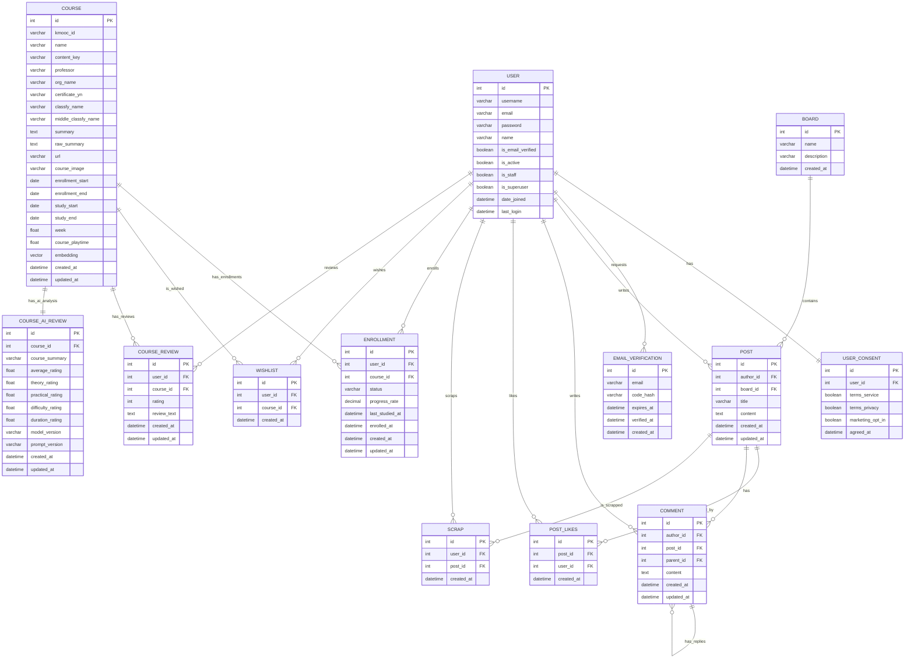

# API

 
 

## [ 기술적 의사결정 및 DB 설계 의도 ]

저희 프로젝트는 확장성과 데이터 무결성, 그리고 AI 기능의 효율적인 통합을 최우선으로 고려하여 데이터베이스를 설계했습니다. 주요 설계 포인트는 다음과 같습니다.
 
 
### 1. 도메인 주도 설계와 의존성 분리
-  **앱(App) 간 역할의 명확화**: 데이터의 성격에 따라 `accounts`(유저), `community`(게시판), `courses`(강의)로 도메인을 분리했습니다.

-  **Aggregation Layer로서의 MyPage**: `mypage` 앱은 독자적인 모델을 갖지 않고, 타 앱의 데이터를 조합(Aggregation)하여 사용자 중심의 뷰를 제공하는 역할만 수행합니다. 이를 통해 앱 간의 불필요한 순환 참조를 방지하고 데이터 소유권을 명확히 했습니다.
 
 
### 2. 데이터 무결성 및 최적화
-  **확장 가능한 좋아요(Like) 시스템**: `Post`와 `User`의 M:N 관계에서 단순 `ManyToManyField`를 사용하지 않고, `PostLike` 중개 모델을 정의했습니다.
    - 이유: 좋아요가 생성된 시점(`created_at`)을 기록하여 향후 '실시간 인기글' 로직이나 '유저 활동 타임라인' 기능을 구현할 수 있는 기반을 마련했습니다.

- **재귀적 댓글 구조**: `Comment` 모델에서 `parent` 필드를 `self`로 참조하도록 설계하여, 대댓글의 깊이 제한이 없는 유연한 토론 구조를 구현했습니다.

-  **정밀한 진도율 관리**: 강의 진도율(`progress_rate`)은 부동소수점 오차를 방지하기 위해 `Float` 대신 **`DecimalField`**를 사용하여 0.01% 단위까지 정확하게 관리합니다.

- **철저한 중복 방지**: `UniqueConstraint`를 적극 활용하여 코드 레벨뿐만 아니라 DB 레벨에서도 중복 데이터(중복 수강신청, 중복 좋아요, 중복 스크랩)를 원천 차단했습니다.
 
 
### 3. AI 및 벡터 검색 도입 (`AI & Vector Search`)
- **PostgreSQL pgvector 활용**: `Course` 모델에 1536차원의 `VectorField`를 도입했습니다. 단순 키워드 검색을 넘어, 강좌 소개글의 문맥을 이해하는 의미 기반 검색(Semantic Search)과 RAG(검색 증강 생성) 시스템을 구축하기 위함입니다.

- **LLM을 이용하여 강의 평가를 미리 진행 후 DB에 적재(`CourseAIReview`)**: 강의 정보를 단순히 저장하는 것에 그치지 않고,, **이론적 깊이, 실무 활용도, 난이도** 등의 지표를 1~5점 척도로 평가하여 별도 컬럼으로 저장했습니다. 이를 통해 사용자에게 직관적인 비교 지표를 제공하고, 사용자의 니즈에 맞는 강의를 추천하기 위한 기반을 마련할 수 있습니다.
 
 
### 4. 사용자 경험(UX)을 고려한 데이터 분리
- **목적에 따른 저장 기능 분리**: 사용자의 저장 행위를 목적에 따라 엄격히 분리했습니다.
    - **Scrap**: 다시 보고 싶은 게시글
    - **Wishlist**: 관심 있는 강의
    - **Enrollment**: 실제 수강 중인 상태

- **법적 준거성 확보**: `UserConsent` 모델을 `User`와 1:1로 분리하여 서비스 이용약관, 개인정보 처리방침, 마케팅 수신 동의 이력을 독립적으로 관리하며, 추후 약관 개정 시 이력 관리가 용이하도록 설계했습니다.