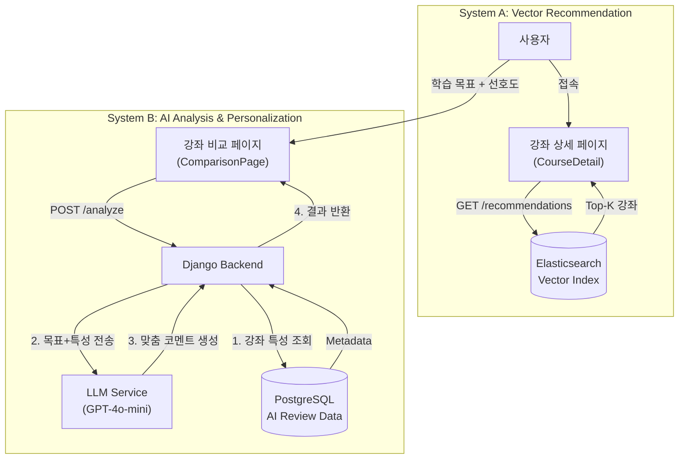

# 추천 및 AI 분석 시스템

## 1. 개요
Project Life-Learn는 사용자의 탐색 경험을 향상시키기 위해 두 가지 상호보완적인 추천/분석 시스템을 운영합니다.

1. **유사 강좌 추천 (Vector-based Recommendation):** 현재 보고 있는 강좌와 **내용이 유사한** 강좌를 찾아줍니다.
2. **AI 강좌 분석 및 개인화 (LLM-based Analysis):** 사용자의 **학습 목표와 강좌의 적합성**을 분석하여 맞춤형 조언을 제공합니다.

---

## 2. 시스템 A: 유사 강좌 추천
**"이 강좌를 본 사용자들이 관심을 가질 만한 다른 강좌는?"**

### 2.1 핵심 원리: 콘텐츠 기반 필터링 (Content-based Filtering)
강좌의 텍스트 데이터(제목, 요약, 카테고리)를 고차원 벡터로 변환하여, 벡터 공간 상에서 거리가 가까운 강좌를 추천합니다. 사용자의 행동 데이터(로그)가 없어도 즉시 추천이 가능한 'Cold Start' 문제에 강한 방식입니다.

### 2.2 기술 스택
- **Embedding Model:** OpenAI `text-embedding-3-small` (1536차원)
- **Vector DB:** Elasticsearch (`dense_vector` 필드)
- **Search Algo:** KNN (k-Nearest Neighbors) + Cosine Similarity

### 2.3 동작 프로세스
1. **임베딩 생성:** 강좌의 `[제목]*3 + [카테고리] + [요약]`을 조합하여 풍부한 문맥 벡터 생성.
2. **벡터 검색:** 사용자가 강좌 상세 페이지 진입 시, 해당 강좌의 벡터를 Query로 Elasticsearch에 전송.
3. **유사도 정렬:** 코사인 유사도가 가장 높은 상위 4개 강좌를 실시간으로 반환.

### 2.4 활용처 (UI)
- **강좌 상세 페이지 (`CourseDetailPage.vue`)**
  - 최하단의 "이 강좌와 유사한 추천 강좌 ✨" 섹션
  - `getRecommendedCourses(courseId)` API 호출

---

## 3. 시스템 B: AI 강좌 분석 및 개인화 (AI Advisor)
**"이 강좌가 과연 나의 학습 목표에 맞을까?"**

### 3.1 핵심 원리: 생성형 AI (Generative AI)
단순한 데이터 매칭을 넘어, LLM(Large Language Model)이 강좌의 특성과 사용자의 구체적인 목표를 '이해'하고 논리적인 이유와 함께 추천 여부를 판단합니다.

### 3.2 기술 스택
- **LLM:** GPT-4o-mini (via GMS API)
- **Prompt Engineering:** Role-playing (전문가 페르소나), Few-shot learning
- **Pre-computed Data:** `CourseAIReview` (미리 생성된 AI 평가 데이터)

### 3.3 주요 기능

#### 3.3.1 AI 맞춤 코멘트 (Personalized Comment)
사용자가 "비전공자인데 데이터 분석가가 되고 싶어요"라고 입력하면, AI가 강좌의 특성(실습 비중, 난이도 등)을 분석하여 설득력 있는 조언을 생성합니다.
> **예시:** "이 강좌는 파이썬 기초부터 시작하므로 비전공자에게 적합하며, 특히 3주차의 데이터 시각화 실습은 분석가 포트폴리오에 큰 도움이 될 것입니다."

#### 3.3.2 정량적 AI 평가 (Course AI Review)
모든 강좌에 대해 LLM이 미리 분석한 4가지 지표를 제공하여 객관적인 비교를 돕습니다.
- **이론적 깊이 (Theory):** 개념 원리 중심인가?
- **실무 활용도 (Practical):** 현업 프로젝트에 적용 가능한가?
- **학습 난이도 (Difficulty):** 선수 지식이 필요한가?
- **학습 기간 (Duration):** 주차 수 대비 적절한가?

#### 3.3.3 매칭 점수 (Match Score)
사용자가 선호하는 학습 스타일(예: "이론보다는 실습 중심")과 AI가 분석한 강좌 특성을 수치적으로 대조하여 적합도(%)를 계산합니다.

### 3.4 활용처 (UI)
- **강좌 비교 분석 페이지 (`ComparisonPage.vue`)**
  - **입력:** 관심 강좌 선택 + 학습 목표("비전공자인데..") + 선호도 가중치(이론/실무 등)
  - **결과 (`AnalysisResultList.vue`):**
    - **AI 최우수 추천 (Hero Section):** 1위 강좌에 "👑 AI 최우수 추천" 배지와 함께 맞춤형 코멘트 강조 표시.
    - **분석 카드:** 각 강좌별 적합도 점수, 장단점 요약, AI 평가 지표 시각화.
  - **API:** `analyzeComparison(params)` 호출

- **강좌 상세 페이지 (`CourseDetailPage.vue`)**
  - **AI 요약:** "AI 3줄 요약" 섹션 (`InfoSection.vue`)에서 강좌 핵심 내용을 빠르게 파악.
  - **API:** `getCourseDetail(courseId)` 응답의 `ai_summary` 필드 사용.

---

## 4. 시스템 비교 요약

| 구분 | 유사 강좌 추천 (System A) | AI 강좌 분석 (System B) |
| :--- | :--- | :--- |
| **목적** | 탐색의 확장 (더 많은 볼거리 제공) | 의사결정 지원 (수강 여부 판단) |
| **질문** | "비슷한 내용은 무엇인가?" | "나에게 맞는 강좌인가?" |
| **핵심 기술** | Vector Search (Elasticsearch) | LLM Prompting (GPT-4o-mini) |
| **실시간성** | 실시간 (밀리초 단위) | 실시간 (수 초 소요) + 배치(Batch) 혼합 |
| **개인화 수준** | 낮음 (강좌 간 유사성 중심) | 높음 (사용자 목표 반영) |

---

## 5. 아키텍처 다이어그램

